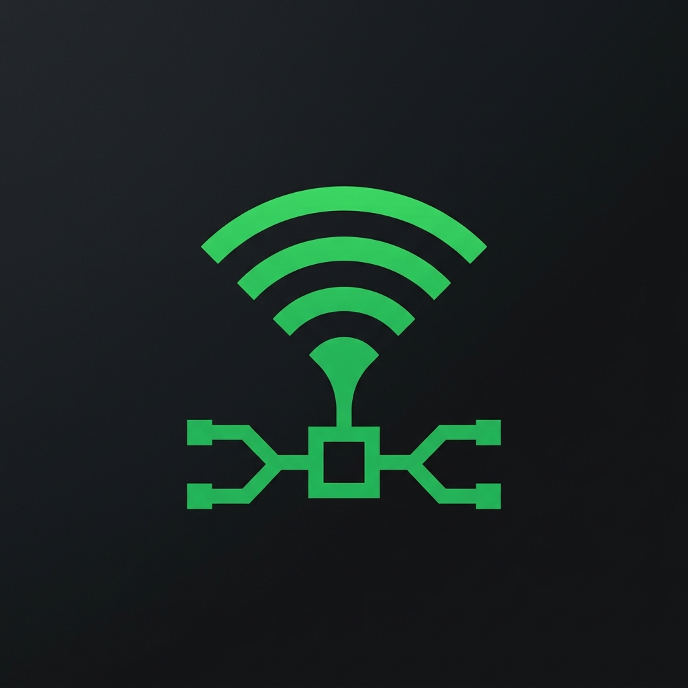

<p align="center">
  
</p>

<h1 align="center">Spotify MCP Server</h1>

<p align="center">
  Control Spotify from Claude. Playback, search, playlists, queue, and more.<br>
  Built with <a href="https://github.com/modelcontextprotocol/python-sdk">FastMCP</a>. Works with Claude Desktop and Claude Code.
</p>

> **Note:** Spotify Premium is required for playback control (play, pause, skip, volume). Search and playlist features work on free accounts.

## Features

16 tools for full Spotify control:

| Category | Tools |
|----------|-------|
| **Playback** | get current track, play, pause, skip, previous, volume |
| **Search** | tracks, albums, artists, playlists |
| **Queue** | view queue, add tracks |
| **Playlists** | list, view tracks, create, add/remove tracks |
| **Info** | track details, recently played |

## Prerequisites

You need Spotify API credentials before installing:

1. Go to [developer.spotify.com/dashboard](https://developer.spotify.com/dashboard)
2. Click **Create App**
3. Set the redirect URI to `http://127.0.0.1:8080/callback`
4. Copy your **Client ID** and **Client Secret**

## Install

Choose the method that fits your setup:

### Claude Desktop

**Option A: One-click install (recommended)**

1. Download [`spotify-mcp-server-0.1.0.mcpb`](https://github.com/maloqab/spotify-mcp-server/releases) from Releases
2. Double-click the file
3. Enter your Spotify Client ID and Client Secret when prompted
4. Done

**Option B: Manual config**

Add to `~/Library/Application Support/Claude/claude_desktop_config.json`:

```json
{
  "mcpServers": {
    "spotify": {
      "command": "uv",
      "args": ["run", "--directory", "/absolute/path/to/spotify-mcp-server", "python", "server.py"],
      "env": {
        "SPOTIFY_CLIENT_ID": "your_id",
        "SPOTIFY_CLIENT_SECRET": "your_secret",
        "SPOTIFY_REDIRECT_URI": "http://127.0.0.1:8080/callback"
      }
    }
  }
}
```

### Claude Code

Install as a plugin for slash commands:

```bash
claude plugin add github:maloqab/spotify-mcp-server
```

Set your credentials (add to your shell profile to persist):

```bash
export SPOTIFY_CLIENT_ID="your_id"
export SPOTIFY_CLIENT_SECRET="your_secret"
export SPOTIFY_REDIRECT_URI="http://127.0.0.1:8080/callback"
export SPOTIFY_MCP_DIR="/path/to/spotify-mcp-server"
```

Authenticate (run once to authorize with Spotify):

```bash
cd $SPOTIFY_MCP_DIR && uv sync
uv run python -c "from server import get_spotify; get_spotify(); print('Done')"
```

Then use slash commands:

```
/spotify:now-playing          # What's playing?
/spotify:play Yesterday       # Play a song
/spotify:pause                # Pause
/spotify:skip                 # Next track
/spotify:previous             # Previous track
/spotify:search Drake         # Search for music
/spotify:queue                # View queue
/spotify:playlists            # List playlists
/spotify:volume 75            # Set volume
/spotify:recently-played      # Recent history
```

## Requirements

- Python 3.10+
- [uv](https://docs.astral.sh/uv/)

## License

MIT
